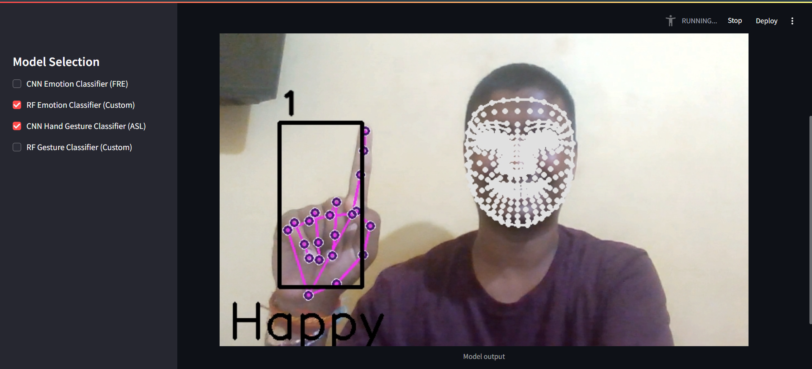
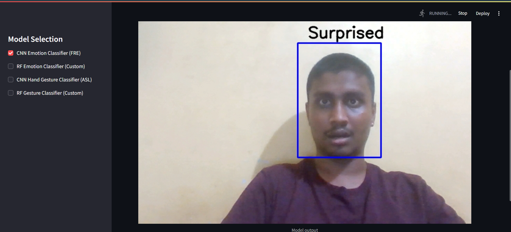
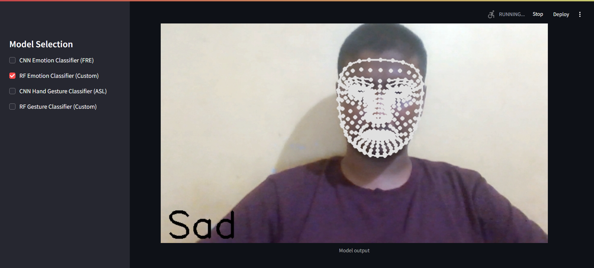
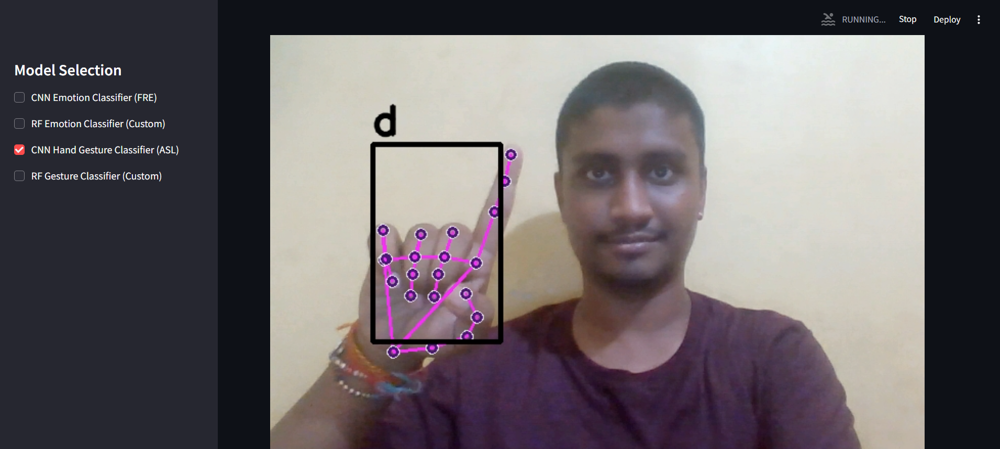
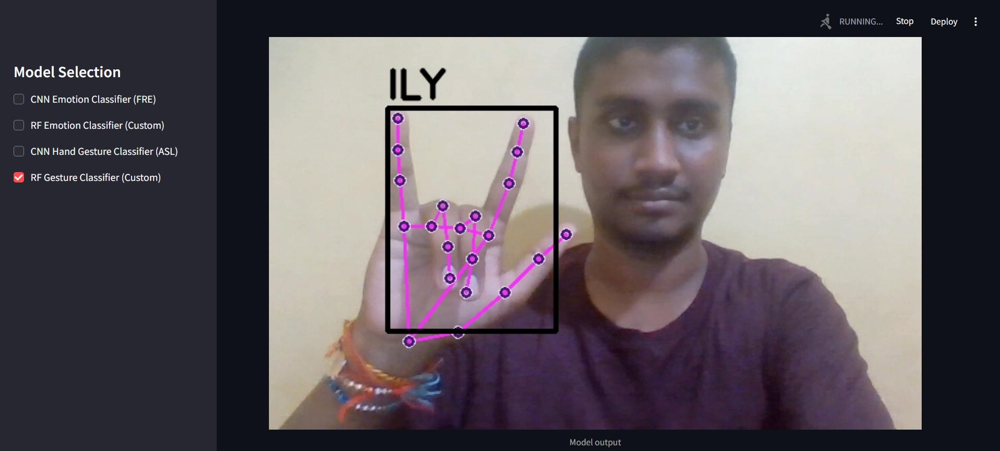
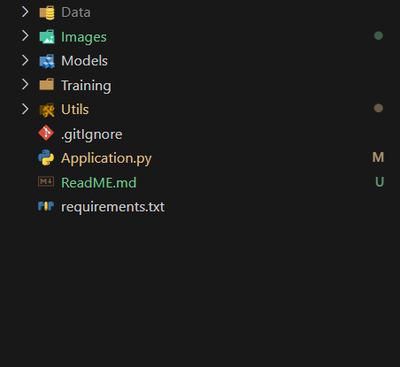

# Synapse
Synapse is a multi-modal system for implementing human-machine interaction based on visual inputs. The project integrates a number of models for classifying human-emotions and hand-gestures.

<br/>

# Table of Contents
1. Features
2. Models 
3. Project Structure
4. Usage
5. Future feature additions

<br/>

## 1. Features
The primary feature of Synapse is that it takes a visual stream input from the streamlit app and then based on the user preference could be used to do the following
- Predict one out of seven available emotions using a CNN model which was trained on the FER-2013 dataset.

- Predict one out of three('happy','sad','surprised') using a RF-model which was trained on a Synthetic-custom dataset made using stable-diffusion.

- Predict one out of 37-ASL characters by using a CNN model which was trained on the ASL dataset.

- Predict one out of five-gestures('thumbs-up','thumbs-down','victory','open-palm','ILY') using a RF-model which was trained on a custom made dataset.


The user can choose which model(s) he wants to use and get the required output.

<br>

## 2. Models
### i. <u>CNN model on FER-2013 dataset</u>
This model was trained on the FER-2013 dataset and is able to distinguish between 7-emotional classes. Its training file is at ```Training\Facial emotion recognizer\Facial Emotion Recognizer.ipynb``` with all additional info regarding the model and its training.

Firstly we detect the face using 'haarland' face detection and then we pass it to the above described model to get the emotion predictions.


<br>

### ii. <u>RF model on Custom-face dataset</u>
This RF model was trained using a custom-dataset that was created with the help of ```stable-diffusion```. The dataset has only three emotions ('sad', 'happy', 'surprised'). 

We preprocessed that dataset and created a .txt file with facial-landmark points created with the help of Mediapipe's ```face-mesh```. And then we trained an RFclassifier on the preprocessed data. For more information regarding the model and its training refer to ```Training\Facial emotion recognizer\Custom Emotion Recognizer RF.ipynb```.

Now on feeding the RF classifier the 1404-facial-landmark points we get the classified emotion.


<br>

### iii. <u>CNN model on the ASL-dataset</u>
This CNN model was trained for classfiying between the 37-characters(0-9,a-z) of the ASL('American Sign Language'). The model was trained using the ASL dataset.

The dataset is firstly-processed by storing the hand-landmark points extracted using mediapipe. Then a deep-learning based model is trained on this extracted data. For more info about the model refer to ```Training\Hand gesture recognizer\ASL Data CNN Training.ipynb```.

Now on giving the hand-landmark points to the CNN model we get the classified ASL-character.


<br>

### iv. <u>RF model on custom hand dataset</u>
This RF model was trained for classfiying between 5-gestures('thumbs-up','thumbs-down','victory','open-palm','ILY'). The model was trained using a custom dataset that was created using opencv.

The dataset is firstly-processed by storing the hand-landmark points extracted using mediapipe. Then a RandomForest Classifier was trained on this data. For more info about the model refer to ```Training\Hand gesture recognizer\Custom Data Classifier RF Training.ipynb```.

Now on giving the hand-landmark points to the RF model we get the classified hand-gesture.


<br>

## 3. Project Structure-
The entire project application has 5 major directories with their respective subdirectories.


- <u>Data:</u> The data directory contains all the data used for training all the models. (It has not been uploaded on github)

- <u>Images:</u>This directory contains images for ReadME.

- <u>Models:</u>The models directory contains all the above defined models and their previous versions.

- <u>Training:</u>The training directory is the core of this entire project as it contains the code(or link to notebooks) for training all the models.

- <u>Utils:</u>This directory brings all the features together and offers it to the 'Application.py' when needed.

<br>

## 4. Usage 
For using this project you don't have to re-train all the models as they are already available. You just have to -
1. Clone this repo
2. Run: ```pip install -r requirements.txt```
3. Run: ```streamlit run Application.py```

<br>

## 5. Future Feature Additions
Currently this project is very minimal with only visual input and ```non-context based``` human interaction. I want to add many more features to it and make ```Synapse``` a multi-modal human-computer interaction system where the user could interact with the machine not only through the visual data but also through the audio and text data.